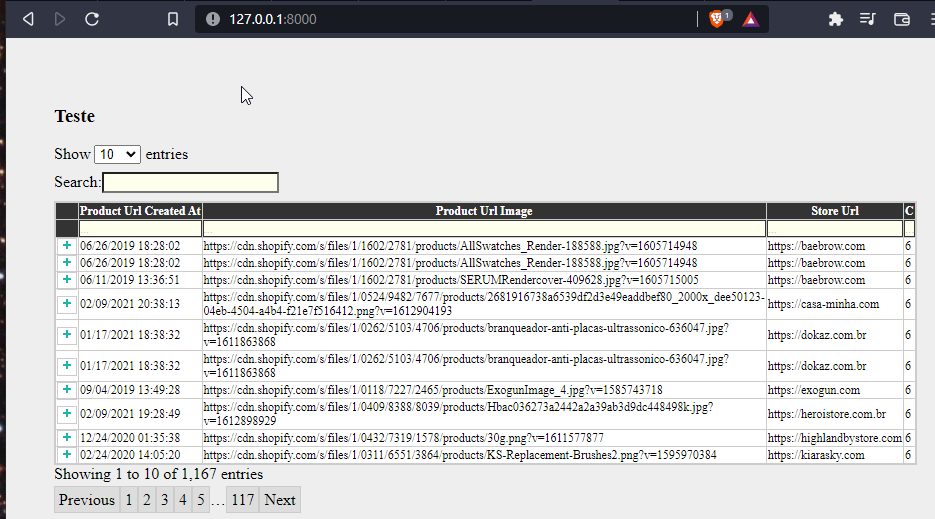

Teste

Para popular o banco de dados tive que fazer uma pequena alteração nos dados onde havia '__' para '_'
O Django e python entender isso como função interna

Para popular o banco de dados

````
python manage.py migrate
python manage.py seed_db
````

Porém para rodar consegui criar nada com Ajax feito por mim, usei uma  lib (https://pypi.org/project/django-ajax-datatable/) para mostrar a tabela na tela. 

Conheço bem mais e uso muito mais Django Rest Framework

Para execução do servidor

````
python manage.py runserver
````



